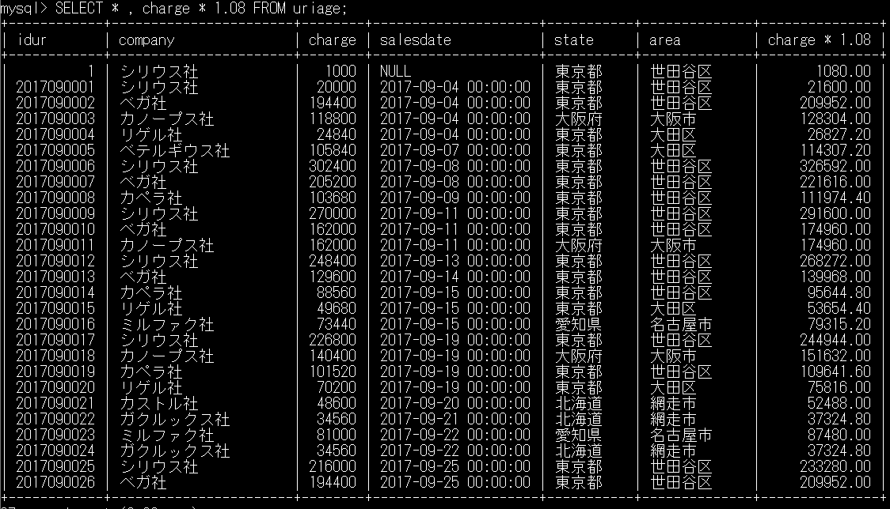

# 5-2 算術演算子

subject: DB
day: 2026年6月4日

基本的な算術演算子：+,=,*,/

上記に加えて、

- 商を求める演算子（DIV）　←整数除算
    
    及び
    
- 余りを求める演算子（%、MOD）
    
    も含まれる
    

【確認】
```SQL
13÷3=4…1
```
> phpmyAdminに上記のSQL文を入力すると、構文チェックにバグがあるようでエラーが表示されるが、問題なく実行できる

［図5-2］

```sql
除算
	SELECT 13 / 3; ←4.3333....
商
	SELECT 13 DIV 3; ←4
余り
	SELECT 13 % 3; ←1
	SELECT 13 MOD 3; ←1
```

［リスト5-5］

```sql
SELECT * , charge * 1.08 FROM uriage;
出力されたuriageテーブルのすべてのカラムに、「charge * 1.08」という名前のカラムが追加され
その列に計算結果が出力される
```



## 基本的な比較演算子

- ＝　等しい
- ＜＞　等しくない
- ＜
- ＜＝
- ＞＝
    
    ※　！＝も使用可能　→　ほかのDBMSとの互換性を考え、非推奨！
    

### 【確認】

［リスト5-6］

```sql
SELECT * FROM uriage WHERE charge >= 200000;
SELECT * FROM uriage WHERE company <> 'シリウス社';
SELECT * FROM uriage WHERE company != 'シリウス社';
```

※上記の等号、不等号の演算子に加えて、下記の演算子も比較演算子に含まれる

1. IS：NULLには統合演算子は使えない
    
    否定：NOTの記述位置に注意！英文が成立するように、IS NOT となる
    
    ＜＝＞：NULL**にも**使える演算記号
    

【確認】

```sql
SELECT * FROM uriage WHERE salesdate = NULL;
SELECT * FROM uriage WHERE salesdate IS NULL;
SELECT * FROM uriage WHERE salesdate<=> NULL;

<=>：NULL専用ではない

SELECT * FROM uriage WHERE salesdate <=> '2017-09-04';
SELECT * FROM uriage WHERE salesdate = '2017-09-04';
```

1. LIKE：あいまい検索
    
    →あいまいな文字の表現に使用する記号は２つ
    
    1. %：０文字以上の任意の文字
    2. _：任意の１文字
        
        →文字数指定の場合、指定数だけ_（アンダースコア）を使用する
        
    
    ［パターン例］
    
    - 後方一致：’%区’　→　港区、板橋区、世田谷区　など
    - 前後一致：’東京都%市’　→　東京都町田市、東京都武蔵野市　など
        
        　　　　　’ボールペン_１ダース’　→　ボールペンアカ１ダース
        
    - 前方一致：’大阪%’　→　大阪府、大阪市、大阪市役所　など
    - 部分一致：’%有限会社’　→　〇〇有限会社、有限会社△△　など
    
    【確認】
    
    ```sql
    SELECT * FROM uriage WHERE area LIKE '%区';
    SELECT * FROM uriage WHERE area LIKE '__区';　←アンスコ2つ
    ```
    
    
    
2. BETWEEN：指定範囲内を示す演算子（※**指定した値を含む！**）
    
    ［書式］
    
    ```sql
    BETWEEN 下限値 AND 上限値
    ```
    
    ［使用例］
    
    - BETWEEN 20 AND 25　→　20以上25以下
    - BETWEEN ‘2017-01-01’ AND ’2017-09-30’　→2017/01/01 以降 2017/09/30 以前
        
        ※文字列の範囲指定も可能だが、大小関係がわかりにくい場合もあるので要注意
        

【確認】

```sql
SELECT * FROM uriage WHERE charge BETWEEN 200000 AND 300000;
SELECT * FROM uriage WHERE charge >= 200000 AND charge <=300000;
```


1. IN：論理和に相当する演算子
    
    ［書式］
    
    IN（値、値、値…）
    
    →いずれかの値に該当すればよい。もちろんすべての値が該当してもよい
    
    ［使用例］
    
    ```sql
    IN ('シリウス社','ベガ社','カノープス社')
    IN (222,555,777)
    ```
    

【確認】リスト5-12

```sql
SELECT * FROM uriage
WHERE company IN ('シリウス社','ベガ社','カノープス社');

SELECT * FROM uriage
WHERE
company = 'シリウス社' OR company ='ベガ社' OR company ='カノープス社';
```


