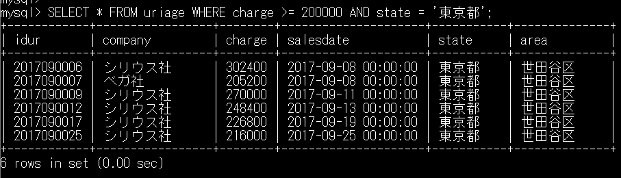

# 5-4 論理演算子

subject: DB
day: 2026年6月4日

---

# 基本的な論理演算子

AND（かつ）、OR（または）、NOT（ではない）

［注意①］

Javaと同様、演算子の記号も利用できるが、下記の点で使用を控えるほうが良い。

1. 標準SQLの記法ではない
2. 他のDBMSとの互換性が懸念される

［注意②］論理演算子には優先順位がある

NOT > AND> OR

意図しない結果になる可能性があるので要注意

→必要に応じて（）を利用して優先順位を上げる

［例］

リスト5-14

```sql
NOT company = 'シリウス社' OR company = 'ベガ社';
	→シリウス社ではない　または　ベガ社である
```

リスト5-15

```sql
NOT (company = 'シリウス社' OR company = 'ベガ社');
	→シリウス社でもなくベガ社でもない
```

【確認】リスト5-18

```sql
SELECT * FROM uriage WHERE charge >= 200000 AND state = '東京都';
```


