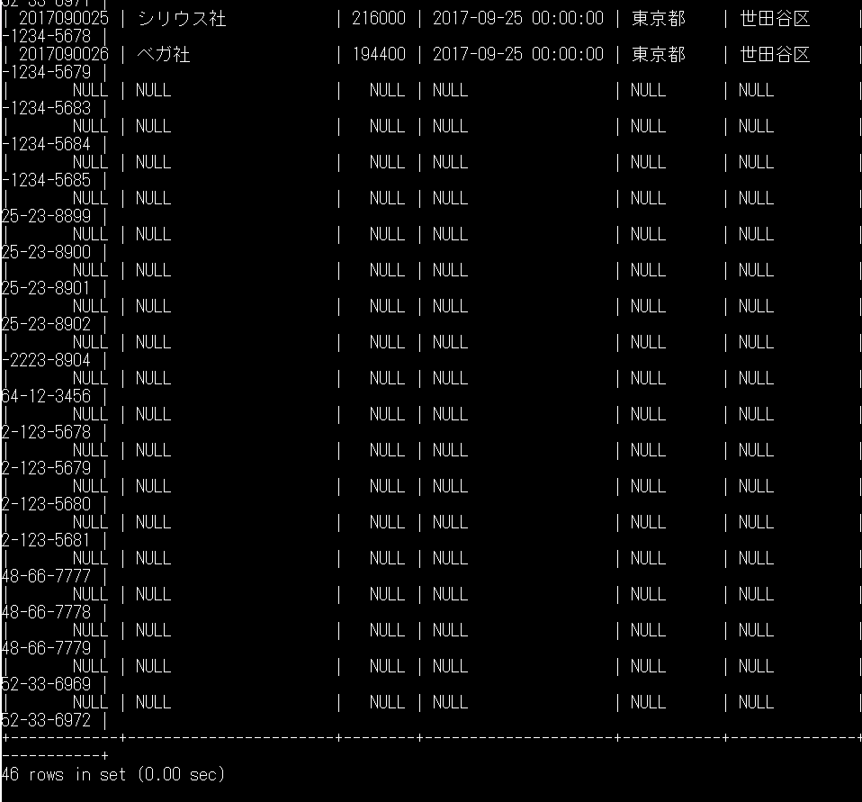

# 8-4 外部結合

subject: DB
day: 2026年6月8日

# 8-4 外部結合（カラムの数を増やす結合）

※主テーブルを基準に、副テーブルのカラムを追加する結合になる

［構文］（主副明確）FROM句のテーブル情報を拡張する形式

```sql
SELECT カラム名リスト FROM テーブル1 LEFT/RIGHT OUTER JOIN テーブル2
	　　　　　　　　　　　　　（左）　　_　　　　　　　　　　　　（右）
ON テーブル1.カラム名1 = テーブル2.カラム名2;
```

※JOINキーワードに対して

『左』側（上記の例ではテーブル1）を基準に、

右側の情報を追加する結合を『左』外部結合とよぶ

『右側』（上記の例ではテーブル2）を基準に

左側の情報を追加する結合を『右』外部結合とよぶ

【確認】

［左外部結合］

```sql
SELECT * FROM uriage LEFT OUTER JOIN jusho
ON uriage.company = jusho.company;
```

［右外部結合］通常は使用しない→SQL文の実行分参照

```sql
SELECT * FROM uriage RIGHT OUTER JOIN jusho
ON uriage.company = jusho.company;
```



> ［メモ］
主テーブルのカラムに該当する値が副テーブルに無い場合、NULLが格納される。
通常、重要度・必要度の高いカラムから左に配置されるため、左側のカラムにNULLが格納される右外部結合はあまり使われない。
> 

## ［メモ］INNER/OUTERは省略しない？

最終的には現場のコーディング規則などに従うことになるが、基本的には安全面から省略しないことを推奨する。

✕［例］外部結合（LEFT JOIN table名　→　JOIN table名）

何かしらの原因で「LEFT」が削られた場合、『外部結合』が『内部結合』に変わってしまう。

エラーが発生せずに、意図しない結果が顧客に納品される恐れがある。納品した顧客の更にその先にも関係する顧客が居た場合、影響はどんどん広がってしまうことになる。

〇［例］外部結合（LEFT OUTER JOIN table名　→　OUTER JOIN table名）

何かしらの原因で「LEFT」が削られた場合、構文エラーが発生する。

エラーが解消されるまでは顧客に納品されないため、『意図しない結果が顧客に納品される』ことはない。
