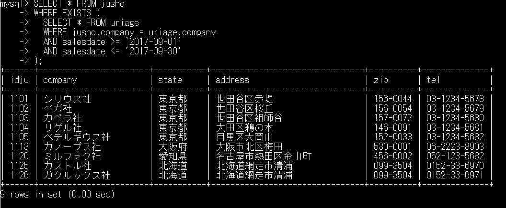

# 8-5 サブクエリ/EXISTS

subject: DB
day: 2026年6月8日

# サブクエリとは

→リテラルの代わりに別のSQL文の結果を使用して、SQL文を実行することができる。

別のSQL文：副問い合わせ、サブクエリ  
大元のSQL：主問い合わせ、メインクエリ

［使用例］

- SELECT、UPDATE、DELETE文のWHERE句
- UPDATE、INSERT文のカラムの値

［構文］

```sql
SELECT カラム名リスト FROM テーブル1　←メインクエリ
WHERE テーブル名1.カラム名1 演算子(SQL文);
				↑サブクエリ
```

【確認】

```sql
SELECT * FROM uriage
WHERE charge > (SELECT AVG(charge) FROM uriage);
```

通常は①SELECT * FROM uriage;を実行後、平均売上金額を求める。  
その後、②SELECT * FROM uriage WHERE charge > 平均売上金額; を実行する。  
この場合、SQL文を２回実行することになる。  
サブクエリを使用すると１回の実行結果で目的の情報を得ることができ、効率よく実行できる  

### ［メモ］サブクエリには４種類ある

| サブクエリの種類 | 列数 | 行数 | 主な用途・演算子 | 例 |
| --- | --- | --- | --- | --- |
| 〇①スカラー | １列 | １行 | ＝、＞、＜ | 平均点より高い生徒の検索 |
| 〇②単一列・複数行 | １列 | 複数行 | IN、ANY、ALL | 東京在住のユーザID一覧に一致する注文履歴の検索 |
| ？③複数列・単一行 | 複数列 | １行 | （列A,列B）=（サブクエリ） | 最高売り上げを達成した「店舗IDと達成日」に完全一致するデータの検索 |
| ？④テーブル | 複数列 | 複数行 | FROM句での仮想テーブル | 一度、部署ごとに売り上げを集計したテーブルを作成し、<br />そのテーブルからさらに別の条件で絞り込んで検索する |

### ［EXISTS演算子の利用］

→　条件を満たすレコードの**存在**を確認する演算子

※レコードの『数』を確認する演算子ではない

→COUNT関数を利用

［例］

```sql
SELECT EXISTS (SELECT * FROM uriage WHERE salesdate >= '2017-09-01'
									AND salesdate <= '2017-09-30';
```

※該当するレコードがあれば１レコードでも同じ結果、すなわちTRUE（１）を返す。

【確認】8-26、8-12

```sql
SELECT * FROM jusho
WHERE EXISTS (
  SELECT * FROM uriage
  WHERE jusho.company = uriage.company
  AND salesdate >= '2017-09-01'
  AND salesdate <= '2017-09-30'
);
```



### ［メモ１］サブクエリの実行順序

1. メインクエリが１行ずつ処理される
2. 各行に対してサブクエリが実行される
3. サブクエリの結果に基づき、EXISTS句が「TRUE」or「FALSE」を判定する
4. 判定結果に応じて、メインクエリの行が結果に含まれるか、が決まる  
    ※EXISTS演算子はサブクエリが結果を見つけた時点で評価を終了し、無駄なデータの取得を行わないので、大規模なデータでチェックを行う場合に効率的に動作する  
    ただし、サブクエリが非常に複雑な場合は効率が低下する恐れがある。
    

### ［メモ２］サブクエリから取り出す列名は何でも構わない　［p213 10行目］慣例的に＊を指定

EXISTS演算子は、特定の条件にあてはまるレコードが存在するか否かを調べるために使用される。そのため、サブクエリで具体的な値を返す必要はなく、少なくとも1行のレコードがあてはまるかどうかで「TRE」「FALSE」を返す。  
そのため、サブクエリのSELECT文では、具体的な列を指定する必要はなく、単に「SELECT *」や「SELECT 1」と記述する場合が一般的である。

1. SELECT 1
    - 定数値「１」を返すため、処理が軽量（EXISTS句の判定には、実際の列指定は不要）
    - コードの意図が明確（存在確認のみを目的としてることが分かる）
2. SELECT *
    - すべての列を取得しようとするため、理論的には処理不可が高い
    - テーブル構造が変更されても影響を受けにくい

※実際の性能については、EXISTS句内のSELECT文は自動的に最適化されるため、「SELECT 1」と「SELECT *」の間に大きな性能差はない。だが、コードの可読性と意図の明確化の観点からEXISTS句では「SELECT 1」の仕様が推奨されている。
