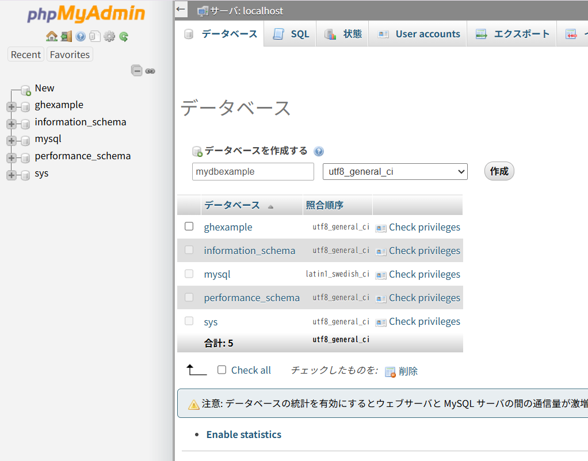

# 9-1 DBの作り方

subject: DB
day: 2026年6月8日
memo: 9章 データベースとテーブルの作成

---

|  | 内容 | イメージ |
| --- | --- | --- |
| DB | 互いに独立したデータ保存領域 | ディレクトリ |
| table | データを保存する領域 | ファイル |

※ディレクトリやファイルにアクセス制御できるように、DBやテーブルにもアクセス制御できる

## 【DB作成手順】

| 項番 | イメージ | 作業の流れ | 書籍の設定 |
| --- | --- | --- | --- |
| 1 | マンション | サーバにログイン | OS：Ubuntu  ユーザ：一般  ユーザ名：user01  パス：ｘｘｘｘ |
| 2 | 住戸 | DBMSにログイン | DBMS：MySQL  ユーザ：管理者  ユーザ名：dbuser  パス：ｘｘｘｘ |
| 3 | 部屋 | DBの作成 | DB名：mydbexamle  （プログラムからの利用も考慮し、英字を採用）  文字コード：UTF-8  （文字化け対策、プログラミング言語の仕様など） |
| 4 | 机 | テーブルの作成 | テーブル名、カラム名、データ型    その他、他テーブルとの連携を考慮すると事前に決めておくことがある  →テーブル定義書作成（p.220 図9-4） |

### ［コマンドライン操作］
［書式］
```sql
CREATE DATABASE DB名 COLLATE 照合順序;
照合順序：文字列の比較・並び替えのルールを定めるもの
```

```sql メモ
-- 日本語対応・大文字小文字を区別しない（よく使われる）
CREATE DATABASE mydb COLLATE utf8mb4_general_ci;

-- 大文字小文字を区別する
CREATE DATABASE mydb COLLATE utf8mb4_bin;

ci = Case Insensitive（大文字小文字を区別しない）の略です。
日本語のデータを扱うなら utf8mb4_general_ci が無難

```

［例］
```sql
CREATE DATABASE mydbexample COLLATE utf8_general_ci;
```

※データ定義言語を手入力する機会は管理者は少ない  
開発者の場合はコマンドライン操作が主流である

1. ログイン
    - 使用ユーザ：管理者ユーザ  
           →一般的にrootが多い。WinはAdministratorを採用
        
    - パスワードが事前に確認しておく必要がある  
        →今回は「xxxx」に設定されている
        
2. DB作成
    - DB名は任意だが、将来数が増えることを見越して、管理しやすい名づけを心がける
        
        →　今回は mydbexample
        
    - 照合順序（文字コードの種類、文字の取り扱い規定など）は、日本語を取り扱うDBの場合、「utf8_general_ci」の指定で問題なし


