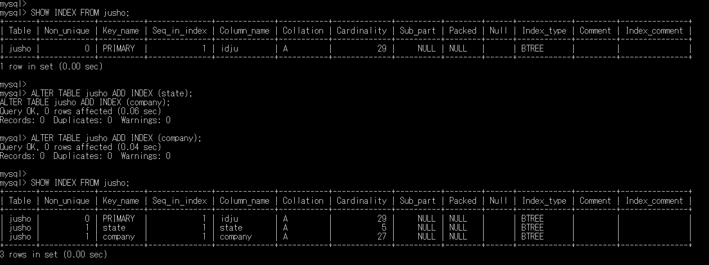

# 10-1 インデックス

subject: DB
day: 2026年6月9日
memo: インデックスとビュー

---

# 10-1 インデックス

とくていのカラムのレコードを効率よく検索するための仕組み

イメージ本の索引

索引使った方が早く欲しい情報見つかる

1. インデックスを作成
    
    検索対象のカラムとレコードを順番に紐づけて管理
    
    【メリット】
    
    本の索引を利用して目的のキーワードを含むページを検索できるように、効率よくキーワードを含むレコードを検索できる。
    
    【デメリット】
    
    1. 本の索引にページ数を割く＝インデックスにも容量を割く必要がある
    2. 対象カラムが更新されると、インデックスも更新する必要がある。そのため、更新処理に時間を要する。
2. キーワードの検索アルゴリズム：Bツリーなど
    
    検索対象のキーワードをインデックスから効率（バランス）よく検索するためのアルゴリズム
    
    ［例］本の索引のように、キーワードをアルファベット順に整理する
    
3. テーブルから目的のキーワードを含むレコードを検索

### 【インデックスの種類】

1. PRIMARY：主キーの設定採用。一意でなければならない。１つのテーブルに１つだけ設定可能
2. UNIQUE：ユニークキーの設定に採用。複数レコードを持つことはできない。ユニークキーは複数のカラムで設定できるので、必ずしもインデックス内のカラムがユニークであることを意味するのではなく、これらのカラム間のデータの組み合わせがユニークであることを意味する
3. INDEX：通常のカラムの設定に使用。主キーやユニークキーではない場合、テーブルに挿入されたデータを制約することはできないが、より効率的にデータを検索することができる。
4. FULLTEXT：全文検索を可能にする、より専門的なインデックスの形式。基本的には、指定されたカラム（テキスト型）の各単語に対して、インデックスを作成する。

### 【インデックスの確認】

MySQLでは、主キーや外部キーを設定したカラムにインデックスが暗黙的に設定される。

［コマンドライン］

［基本構文］

```sql
SHOW INDEX FROM テーブル名;

確認
SHOW INDEX FROM jusho;
```

※　SHOW文は「データ定義言語」ではなく、DBMSが独自に提供している拡張構文である（管理・情報取得用コマンド）

［参考］【データ型の確認】

［基本構文］

```sql
SHOW COLUMNS FROM テーブル名;

確認
SHOW COLUMNS FROM uriage;

SHOW COLUMNS FROM urigae \G
```

※　横表示でレイアウトが崩れる場合、文末の「；」の代わりに「\G」で縦表示に切り替えることができる

---

# 【インデックスを作成する前に】

［p.249］

［インデックスの使用状況の確認］

実行するSQL文の前に「EXPLAIN」キーワードを記述して実行する。

→　DBMSが独自に提供している拡張構文

→『実行計画』が表示される

［SQLの実行の流れ］

1. SQL文の作成
2. 構造解析
3. 書き換え
4. 実行計画
5. 実行
6. 結果
    
    ［基本構文］
    
    ```sql
    EXPLAIN SQL文;
    ```
    
    ［確認］
    
    ```sql
    EXPLAIN SELECT * FROM jusho WHERE state='大阪府';
    
    EXPLAIN SELECT * FROM jusho \G WHERE state='大阪府';
    
    	→　実行結果
    		type：ALL、key：NULL、ref：NULL、rows：29、Extra：Usign where
    ```
    

## 【インデックスを作成する】

［p.247］

基本構文

```sql
ALTER TABLE テーブル名 ADD インデックス名 (カラム名リスト);
```

ALTER・・・既存の項目に変更を加えるときに使用する命令

カラム名リスト・・・単一／複数両方に設定可能

インデックス名・・・省略可能。自動的にカラムの名前になる

【確認】

```sql
SHOW INDEX FROM jusho;
ALTER TABLE jusho ADD INDEX (state);
ALTER TABLE jusho ADD INDEX (company);
SHOW INDEX FROM jusho;
```



## 【インデックスの使用状況の確認】

【確認】

```sql
EXPLAIN SELECT * FROM jusho WHERE state='大阪府';
```

変更前


変更後


## 【インデックスの削除】

基本構文

```sql
ALTER TABLE テーブル名 DROP INDEX インデックス名;
```

確認

```sql
インデックス名を調べる
SHOW INDEX FROM jusho;

インデックス名を指定して削除する
ALTER TABLE jusho DROP INDEX state;
ALTER TABLE jusho DROP INDEX company;

消えたかどうかの確認をする
SHOW INDEX FROM jusho;
```


