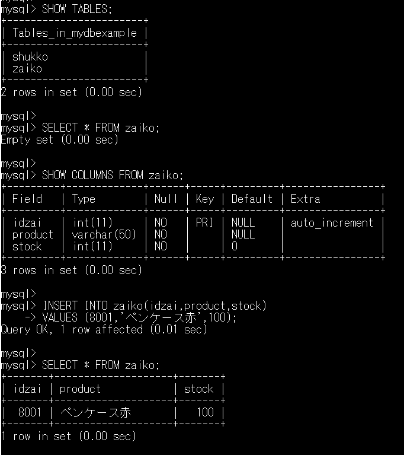

# 11 トランザクション［とロック］

subject: DB
day: 2026年6月11日

# 11-1 トランザクション

１つのSQL文として、切り離せない複数のSQL文をまとめて実行するための仕組み

→　この仕組みをACID特性と呼ぶ［p.265］

1. A：Atomic　原子性
2. C：Consistency　一貫性
3. I：Isolation　分離性
4. D：Durability　永続性

［事例］

銀行の振込処理、在庫処理管理など

［例］

口座から引き落とされたのに振り込まれなかった、商品を出庫したのに在庫数に変化がない

↑　データの不整合が許されない処理（②一貫性）

→データの不整合が許されない操作：全て実行されたor実行されなかったの二者択一の操作（①原子性）

密接に関連する複数の処理が外部からは１つの操作に見える＝第三者には途中の処理は見られない：③分離性

トランザクションの開始

1. SQL文の実行前にトランザクションを実行

```sql
START TRANSACTION;
```

1. SQL文の実行
2. トランザクションの…
    
    ```sql
    処理取り消し
    ROLLBACK;
    
    終了
    COMMIT;
    ```
    
3. 処理結果がDBに反映される（④映像性）

### 【確認】［例］在庫管理処理

※管理者権限で実行すること

```sql
ログインしてるユーザー名の確認コマンド
SELECT USER();

または

SELECT CURRENT_USER();

---

| コマンド | 内容 |
|---------|------|
| `USER()` | ログイン時に使ったユーザー名 |
| `CURRENT_USER()` | 実際に適用されている権限のユーザー名 |

基本的にはどちらも同じ結果になります。
```

［11-2］在庫作成する

```sql
--rootユーザでログインする
mysql -u root -p
rdbpass

--ユーザ確認
SELECT USER();

--DB選択
use mydbexample

--使ってるDBの確認
SELECT DATABASE();

--DBのテーブル確認
SHOW TABLES;

--在庫テーブルの中身確認
SELECT * FROM zaiko;

--在庫テーブルのカラム確認
SHOW COLUMNS FROM zaiko;SEL

--在庫テーブルのデータの作成
INSERT INTO zaiko(idzai,product,stock)
VALUES (8001,'ペンケース赤',100);

--在庫テーブルのデータが出来たか確認
SELECT * FROM zaiko;
```



```sql
トランザクション処理

--出庫テーブルの中身確認
SELECT * FROM shukko;

--出庫テーブルのカラム確認
SHOW COLUMNS FROM shukko;

--トランザクション処理開始
START TRANSACTION;

--出庫テーブルの作成
INSERT INTO shukko(idko,taiou,outnum,outdate)
VALUES (2017090001,8001,30,'2017/09/25');

--出庫テーブルの中身確認
SELECT * FROM shukko;

--在庫テーブルの中身確認
SELECT * FROM zaiko;

--在庫数を更新する
UPDATE zaiko SET stock = stock - 30
WHERE idzai = 8001;

--在庫テーブルの中身確認
SELECT * FROM zaiko;

--1.ロールバックで処理の取り消し
ROLLBACK;

--2.コミットで処理の確定
COMMIT;

--在庫テーブルの中身確認
SELECT * FROM zaiko;
```

ロールバックver


コミットver


※本来の作業は、更新作業（INSERT、UPDATE、DELETE文）の前後で、SELECT文で確認する作業を実施し、更新作業の成否を確認する。

- 更新作業が問題なく完遂すればCOMMIT
- 更新作業に問題が生じた場合はROLLBACK

［注意］

phpmyadminのSQL実行昨日はフォームから投稿「接続実行切断」を繰り返す仕様。そのためコマンドラインのように逐次確認できず、最終結果しか確認できない。

---

### 【注意】

トランザクションはデータ『制御』言語（DCL）である。その対象はデータ『操作』言語（DML）である。

→データ『定義』言語（DDL）は対象外である。

［例］全レコード削除操作

```sql
トランザクションの対象：DELETE FROM テーブル名;（データ操作言語：DML）
				対象外：TRUNCATE TABLE テーブル名;（データ定義言語：DDL）
```

※以降の学習内容はMySQLの規定で有効になっている機能のため、通常変更する理由がないため割愛
