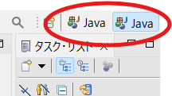
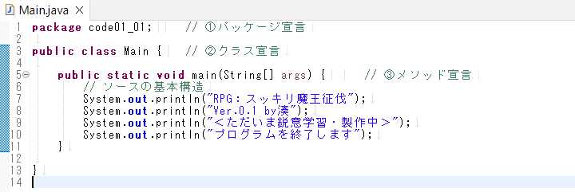
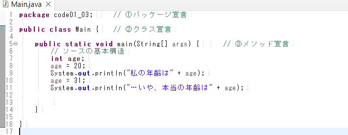
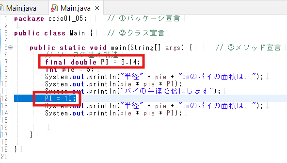

# 1 Javaによる開発の基礎知識

subject: Java
day: 2026年3月27日
memo: 型の違いが怪しいので要復習、章末問題やる

### 1.1　Javaによる開発の基礎知識

**Javaの特徴**
・後発的な言語
・大規模開発支援する「オブジェクト指向」「関数プログラミング対応」
・「標準命令群」「ライブラリ」が多数一般公開されている
・マルチプラットフォーム対応の汎用性

**プログラミングの基本**
①プログラムの入力→コンピュータへの作業指示書の作成
②コンパイル→自然言語をコンピュータの言語へ変換
③実行→指示書に基づきコンピュータが作業する

**JDK**
Javaで開発するために必要なプログラム一式
しくみを理解することに適している環境
キーボードによるコマンド操作のため、開発効率はよくない



**Java開発の基本知識**
①ソースコード作成
　ソースファイル：.java
②コンパイル（コンパイラ、文法チェック）：javacコマンド
　ソースファイルを翻訳したファイル：クラスファイル
　クラスファイルの中身のコード：バイトコード（汎用マシンコード）
③実行（インタプリンタ内のJava仮想マシン(JVM））
　→インタプリンタというソフトウェア内部に実装されているJava仮想マシン(JVM）で各OSのマシンコードに変換される
　→OSに囚われず動作する

javacコマンド：Javaプログラムが書かれているソースファイル(.javaファイル)を読み込んで、クラスファイル(.classファイル)を生成するツール

# まとめ

Javaの開発にはコンパイラとインタプリンタというソフトウェアが必要。

コンパイラ…ソースコード→バイトコードに変換

インタプリンタ…JVMでバイトコード→マシンコードに変換

### 1.2　プログラムの基本構造

**Javaプログラム**
①パッケージ宣言：本棚（具体的な役割はchap06）
②クラス宣言：タイトルß
　→クラス名＝ファイル名
　→ブロック（{}）の中にメソッド宣言を記述する
　→クラス名の頭文字は大文字のアルファベット
③メソッド宣言：例）mainメソッド：第n章
　→ブロック（{}）の中に処理文（本文内容）を記述する


### 1.2.2

```jsx
**大事な意識
1.正確に記述する
	- 大文字小文字の区別
	- （）の種類の区別
	- 引用符の違いを正確に区別する
2.外から内に記述する
	- ブロック開いたらすぐに閉じてから記述する
	- パッケージ＞クラスブロック＞メインメソッド
3.読みやすいソースコードを記述する
	- インデント、コメントを活用する**
```

### 1.2.3、1.2.4、1.2.5

インデント…タブキー使うと良い
コメント…「/* 複数行コメントアウト */」「// 単一行コメントアウト」
文末…「;」をつける



### 1.3　変数

変数に…
値を入れる→**代入**
取り出す→**取得**

#### 変数宣言の文

```jsx
型　変数名；
int age；
※int=整数の型
```

#### **①変数名**

**識別子**…変数に使える文字や数字の並び
　　　　・通常使用できる記号：アンスコ、$
　　　　・宣言済みの名前は再度宣言して使用することはできない
　　　　・数字から始まる名前は**使えない**
**予約語**…変数に使えない単語

静的型付…事前に型を決めてプログラムを実行すること（例）java
動的型付…事前に決めず、プログラム実行時に型が決まる（例）python

**tips!**

```jsx
変数名には**小文字で始まる、格納している情報が予想しやすい名前**を付けること！
	ex）〇　myAge：2つめ以降の単語の頭文字を大文字にする（キャメルケース）
			△　my_age（スネークケース）
			×　my-age（ケバブケース）｜引き算記号と区別がつかないため使用しない
```

②データ型

- 数字系
    - 整数：桁数の大きさで4つの型がある
        - byte＜ short＜int＜long　←通常はint型を使用
        - long型で扱いたい場合、末尾にLをつける
        
        　ex）10000L
        
    - 小数：精度の高さで2つの型がある
        - float（約7桁）＜double（約15桁）　←通常はdouble型を使用
        - float型として扱いたい場合、末尾にFをつける
        
        ※浮動小数点系の使用上の注意
        　→真に厳密な計算ができない。そのため、誤差が許されない計算への使用は要検討
        
        ex）金額の計算等
        
- 文字系
    - 真偽値：true falseの二者択一、引用符で囲まない
    - 文　字：1文字はchar型　シングル「’’」で囲む
    - 文字列：文字列はString型　ダブル「””」で囲む
        - 0文字以上の文字の集まり（2文字以上の文字の集まりではない）
        - 大は小を兼ねるので、1文字でもString型として扱うことは可能


### 変数の初期化…変数の宣言と同時に値を代入すること

```jsx
型　変数名　=　代入するデータ；
int age　　=　"22";
```

- 定数の利用
    
    ※変数の上書き）値が代入されている変数に別の値を代入すると、前の値は上書きされる
    
    ※書き換え防止したい場合、定数扱いにすることができる
    
    
    
    変数を上書きするときは型名から始めるのではなく、変数名だけでよい
    
    ```jsx
    final 型　変数名 = 初期値；
    final int AGE 　= "22"; 
    ```
    
    一般に変数を定数扱いしたい場合、名前はすべて大文字を用いる
    



final変数なので値の上書きができないため、コンパイルエラーとなる
