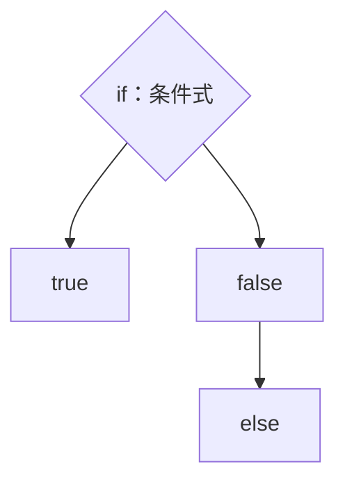
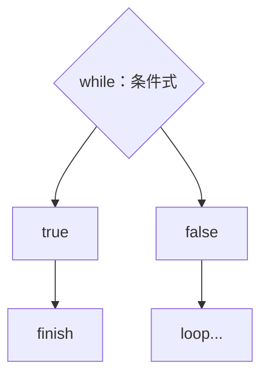
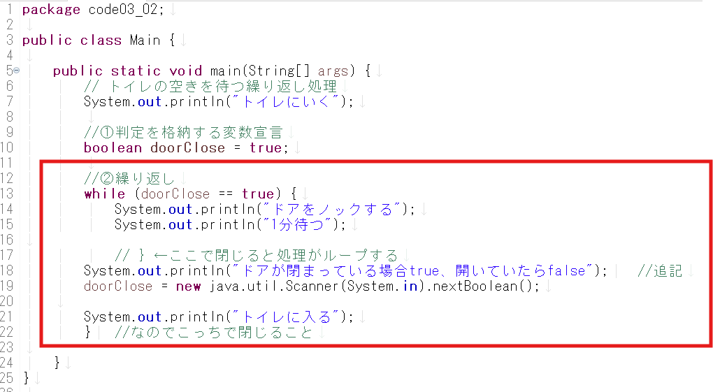
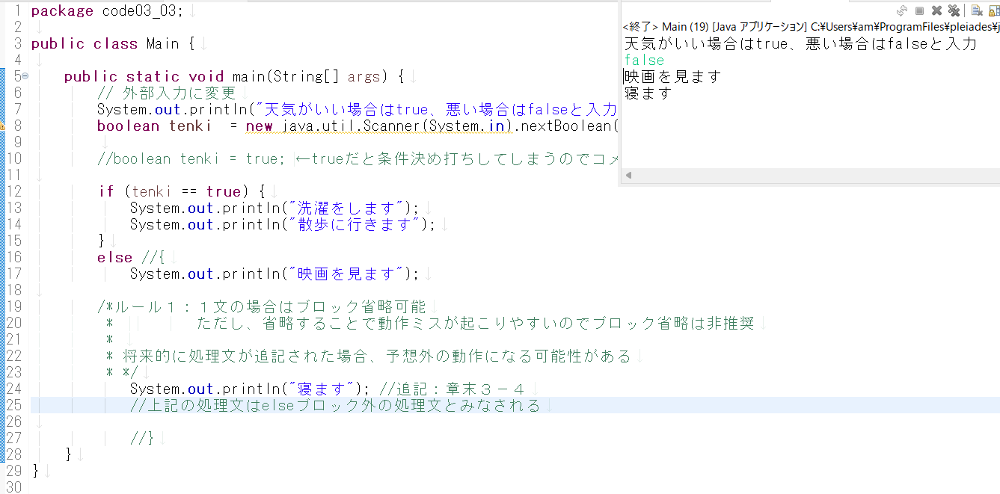

# 3 条件分岐と繰り返し（１）

subject: Java
day: 2026年4月3日
memo: 基本のif構文、while構文、ブロック、スコープ

ここまでのまとめ

```java
	プログラムの基本構造：パッケージ宣言、クラス宣言、メソッド宣言
ソースコードの基本構造：変数宣言の文、　　計算の文、命令実行の文
```

３章からは…

ソースコードの制御構造：①順次、②分岐、③繰り返し
👉制御構造・・・処理の流れ

②分岐







赤枠の部分を「ブロック」と呼ぶ

## ブロックとは

複数の文をひとまとまりにして扱うための範囲

ルール①：処理文が１行の場合に限ってブロックは省略可能
　　　　　→　ただし、動作ミス防止のため推奨されない［確認：章末3-4］



ルール②：ブロック内で宣言した変数は、**ブロック内でのみ使用可能**
　　　　　※ブロック外で宣言した変数は、ブロック内でも使用可能
　　　　　　**［用語］スコープ：変数が使用できる範囲**


赤枠部分をブロックと呼び、ブロック内の変数を使用できる範囲をスコープと呼ぶ。青枠はブロック外のため変数を使用できない。
