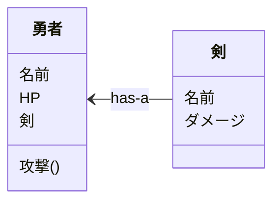

# 9.1 インスタンスの生成とは

subject: Java
day: 2026年4月24日
memo: スタック領域とヒープ領域

---

イメージ：Java仮想世界に、設計された人物が生まれる

コンピュータ：ヒープ領域に情報を格納するためのメモリ領域が確保される

［注意］p.316

JVMは広いヒープ領域の中から現在使用していないメモリ領域を探し出して確保する

↑わかりやすさ重視の説明

↓正確さ重視すると

［例］Hero h = new Hero();

```java
Hero h =
スタック領域
・コンパイル時点でサイズが確保される
メモリ領域
・処理がブロックを抜けたら自動解放される
```

```java
new Hero();
ヒープ領域
・プログラムが実行時に動的にサイズを
確保するメモリ領域
・プログラム自身が確保・解放を管理する
必要がある
```

参照の解決）

［比較］

配列型：添え字で指示された数だけ先頭区画から移動して目的の区画を見つける

［例］変数名［１］←先頭番地を含む区画の１つ隣の区画を探す

クラス型：フィールドで名づけられた区画を先頭の区画から見つける

［例］変数.hp←先頭番地を含む区画から「hp」と名付けられた区画を探す

### ★インスタンスの独立性

同じクラスから生成されても、異なるインスタンスであれば（管理場所が異なれば）互いのフィールドは影響を受けない

→基本的にnew演算子でインスタンスを生成する。

［注意］

クラス型変数同士の代入は、参照のコピー（値渡し）である。［コード9-2］（参照：コード4-15）


new演算子で真の2人目の勇者が生まれている

### クラス型をフィールド、引数、戻り値に用いることができる。

参照型も基本型と同様、変数で取り扱うことが可能

［クラス型をフィールドに用いる例］

クラス図における「has-a」の関係（Hero has a sword）



コード9-1～9-6を通すと色々出来るようになる

### ★String型の真実（×基本形）→〇参照型（クラス型）

【1部】

？String s =”こんにちは”; ←String s = new String(”こんにちは”);

- 特例のおかげで基本形と同じように取り扱うことができる。
1. ［通常］インスタンスの生成には、完全限定クラス名で指定する必要がある。
    
    ［特例］StringクラスはJava.langパッケージに宣言されている。
    
    →　このパッケージは頻繁に使用されるクラスが多いため、パッケージ名の省略ができる。
    
2. ［通常］インスタンスの生成には、new演算子を使用する必要がある。
    
    ［特例］文字列はプログラムの中で多用されるため、new演算子の省略が許されている
    
    →　類似：配列の生成
    

［注意］

Stringインスタンスはヒープ領域に保存される。

→Javaのインスタンスはヒープ領域に保存されるため、Stringインスタンスも例外なくヒープ領域に保存される。


