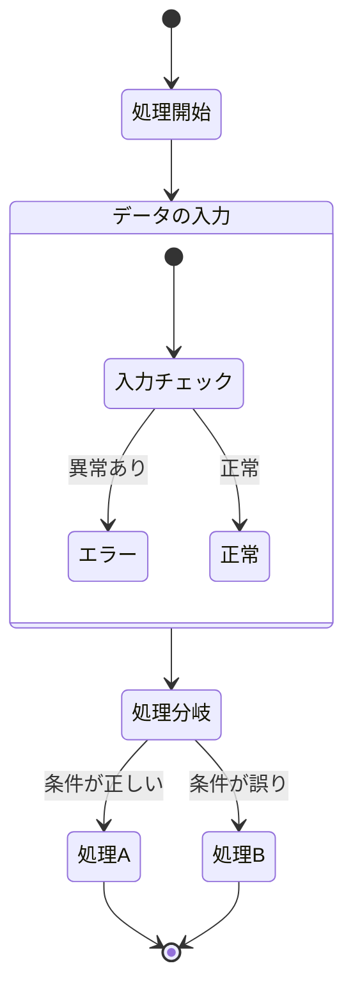
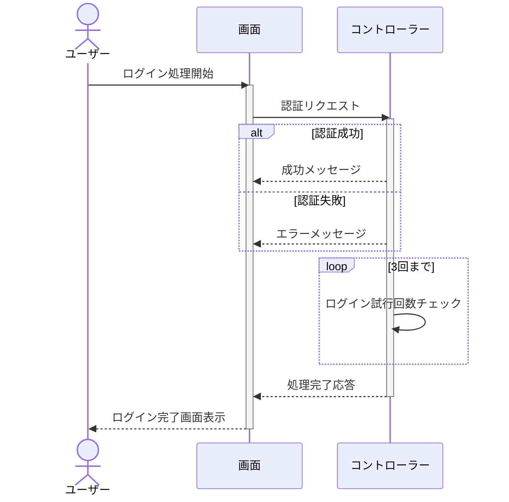
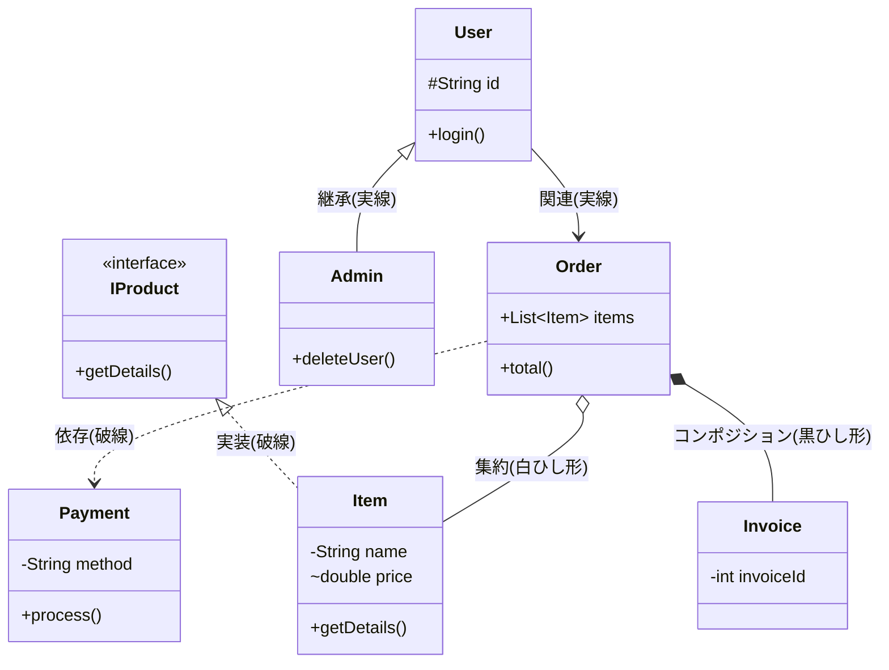

# 開発ドキュメント3

subject: ドキュメントとツール
day: 2026年5月21日
memo: アクティビティ図、シーケンス図、クラス図、ユースケース図

# アクティビティ図

| **図形（記号）** | **名前** | **意味・役割** |
| --- | --- | --- |
| **[*]** | 開始・終了ノード | 処理のスタート地点とゴール地点を表します。 |
| **長方形** | アクション | 具体的な処理や作業内容を書きます。（例：ログインする、計算する） |
| **ひし形** | 分岐（Choice） | 「もし〜ならA、違えばB」という条件分岐のポイントです。 |
| **矢印** | フロー | 処理が次に進む順番（順序）を示します。 |
| **枠線（グループ）** | コンポジット | 複数の処理を一つのまとまりとして扱いたい時に使います。 |

# シーケンス図

| **記号・要素** | **名前** | **意味・役割** |
| --- | --- | --- |
| **縦の線** | 生存線 | 参加者（画面やコントローラー）が処理中に存在している期間。 |
| **細長い枠** | 活性化（Activation） | 処理を実行している期間（activate/deactivate）。 |
| **実線矢印** | 同期メッセージ | リクエストを送る処理。 |
| **点線矢印** | 戻りメッセージ | 処理の結果を返す（破線で表現）。 |
| **alt / end** | グループ化 (分岐) | 「もし〜なら」という条件分岐の塊。 |
| **loop / end** | ループ | 特定の処理を繰り返す塊。 |

# クラス図

| **区分** | **記号・線** | **名前** | **意味・役割** |
| --- | --- | --- | --- |
| **修飾子** | + | public | どこからでもアクセス可能 |
|  | - | private | クラス内部からのみアクセス可能 |
|  | # | protected | 同一パッケージ ＋ サブクラスからアクセス可能 |
|  | ~ | package private | 同一パッケージ内からのみアクセス可能 |
| **関係性** | --> | 関連 | 普通のつながり。お互いを知っている状態。 |
|  | ..> | 依存 | 一時的に「使う」関係（メソッドの引数など）。 |
|  | < | -- | 継承 |
|  | < | .. | 実装 |
|  | o-- | 集約 | 全体と部分の関係（部員がいなくなってもチーム自体は残る）。 |
|  | *-- | コンポジション | 強い結合（建物がなくなると部屋も消滅する）。 |
